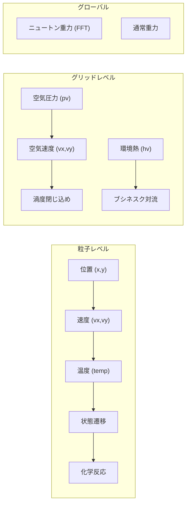

# The Powder Toy — 使い方ガイド＆拡張アイデア

## 1. 基本的な使い方

### 画面構成

```
┌─────────────────────────────────────────────────────────┐
│  FPS表示      シミュレーション領域 (612×384)    圧力表示 │
│                                                         │
│    ← ここに絵を描くように元素を配置する →                │
│                                                         │
├─────────────────────────────────────────────────────────┤
│ [ブラシ][ツール]  PROP WIND AMBP AMBM CYCL MIX NGRV ... │  ← ツールバー
│ [セーブ情報]                          [ユーザー名]       │  ← ステータスバー
│ 壁 電子 爆発物 気体 液体 粉末 固体 特殊 ライフ お気に入り │  ← 元素カテゴリ
└─────────────────────────────────────────────────────────┘
```

### 基本操作

| 操作 | 説明 |
|------|------|
| **左クリック＆ドラッグ** | 選択した元素を描画 |
| **右クリック** | 消しゴム（元素を削除） |
| **中クリック / Alt+左クリック** | 元素をスポイト |
| **マウスホイール** | ブラシサイズ変更 |
| **Space** | 一時停止/再開 |
| **F** | 1フレーム進める（一時停止中） |
| **Z** | ズーム |
| **E** | 元素検索 |
| **TAB** | ブラシ形状切り替え（円/四角/三角） |

### スクリーンショットの作品（RBMK-1000原子炉）について

あなたのスクリーンショットに映っているのは、**コミュニティ作品「RBMK-1000原子炉モデル v1.2」** です。これはTPTの元素を使って作られた非常に精巧な原子炉シミュレーションで：

- **制御棒** (CONTROL RODS): 上下で核反応速度を調整
- **冷却水ループ** (LOOPS): 水で原子炉を冷却
- **蒸気タービン**: 蒸気で発電する仕組み
- **AZ-5ボタン**: 緊急停止（チェルノブイリ原発事故で有名）
- **CORE温度**: 炉心温度のリアルタイム監視

この作品は、TPTの **PLUT（プルトニウム）**, **NEUT（中性子）**, **WATR（水）**, **WTRV（水蒸気）** などの元素と、**SPRK（電流）** による回路制御を組み合わせて構築されています。

---

## 2. 元素カテゴリと使い方

### 下部メニューの各タブ

| カテゴリ | 主な元素 | 遊び方 |
|---------|---------|--------|
| **壁 (Walls)** | 壁、ファン、消去壁 | シミュレーション領域を仕切る・空気の流れを作る |
| **電子 (Electronics)** | METL, SPRK, BTRY, SWCH, FILT | 回路を組んでCPUや論理ゲートを作る |
| **爆発物 (Explosives)** | BOMB, C5, LIGH, DMG, SING | 爆発や破壊の連鎖を楽しむ |
| **気体 (Gas)** | GAS, WTRV, CO2, O2, H2 | 気体の挙動や化学反応を観察 |
| **液体 (Liquids)** | WATR, LAVA, OIL, ACID | 液体力学の実験 |
| **粉末 (Powders)** | DUST, SAND, SALT, SNOW, GUNP | 粉体シミュレーション |
| **固体 (Solids)** | METL, DMND, WOOD, BRCK, GOLD | 構造物を建てる |
| **核物理 (Nuclear)** | PLUT, URAN, NEUT, PROT, ELEC | 原子炉や核分裂の実験 |
| **特殊 (Special)** | STKM (棒人間), CLNE (クローン), PIPE | ユニークな機能 |
| **ライフ (Life)** | LIFE系 | Conway's Game of Life バリエーション |

### ツールバーの特殊ツール

スクリーンショットの下部に見えるカラフルなボタン：

| ツール | 色 | 機能 |
|--------|-----|------|
| **PROP** | 灰 | 粒子のプロパティを直接編集 |
| **WIND** | 灰 | 風を発生させる |
| **AMBP** | 黄 | 周辺圧力を上げる |
| **AMBM** | 黄 | 周辺圧力を下げる |
| **CYCL** | 緑 | サイクロン（渦巻き）を生成 |
| **MIX** | 青 | 粒子を混ぜる |
| **NGRV** | 橙 | ニュートン重力を引く |
| **PGRV** | 橙 | ニュートン重力を押す |
| **VAC** | 水 | 真空を作る |
| **AIR** | 水 | 空気を追加 |
| **COOL** | 青 | 冷却する |
| **HEAT** | 赤 | 加熱する |

---

## 3. 遊び方の例

### 🔬 実験1: 水と溶岩の相互作用
1. 画面左半分に**WATR**（水）を描く
2. 画面右半分に**LAVA**（溶岩）を描く
3. 壁を取り除いて接触させると → 蒸気(WTRV)が発生し、溶岩が冷えて石(STNE)に変わる

### ⚡ 実験2: 簡単な回路
1. **METL**（金属）で線を引く
2. 片端に**BTRY**（電池）を置く
3. 電流（SPRK）が金属を伝わる様子を観察

### 💥 実験3: 核分裂
1. **PLUT**（プルトニウム）の塊を作る
2. **NEUT**（中性子）をぶつける
3. 連鎖反応が起きて大爆発！

### 🌱 実験4: 生態系
1. **PLNT**（植物）を置く
2. **WATR**と**SEED**を供給
3. 植物が成長し、**WOOD**に変わる

### 🔧 高度な遊び方
- **Lua コンソール** (`` ` ``キー): スクリプトで自動制御
- **PIPE** + **CLNE**: 自動化された工場ライン
- **WIFI**: 無線通信で離れた回路を接続
- **FILT**: 光のフィルタリングで色を制御

---

## 4. 現在の物理エンジンの仕組み

### 実装済みの物理システム



### 各物理パラメータ（`Element`クラスより）

```cpp
// 元素が持つ物理パラメータ（WATR.cppの例）
Advection = 0.6f;           // 空気流に乗る度合い
AirDrag = 0.01f * CFDS;     // 空気抵抗
AirLoss = 0.98f;            // 周囲の空気速度減衰
Loss = 0.95f;               // 自身の速度減衰
Collision = 0.0f;           // 衝突時の跳ね返り
Gravity = 0.1f;             // 重力の影響度
Diffusion = 0.00f;          // 拡散率
HotAir = 0.000f;            // 空気加熱率
Falldown = 2;               // 落下挙動 (0=なし, 1=粉, 2=液体)
Weight = 30;                // 重さ（他の粒子との上下関係）
HeatConduct = 29;           // 熱伝導率
HeatCapacity = 1.0f;        // 熱容量

// 状態遷移（温度・圧力ベース）
LowTemperature = 273.15f;           // 凍結点 → ICEI（氷）
HighTemperature = 373.0f;           // 沸点 → WTRV（水蒸気）
```

### 粒子データ構造

```cpp
struct Particle {
    int type;              // 元素タイプ (WATR, FIRE, etc.)
    int life, ctype;       // ライフ値、サブタイプ
    float x, y, vx, vy;   // 位置と速度
    float temp;            // 温度 (ケルビン)
    int tmp, tmp2;         // 汎用パラメータ
    int tmp3, tmp4;        // 追加パラメータ
    int flags;             // フラグ
    unsigned int dcolour;  // デコレーション色
};
```

---

## 5. 追加可能な物理シミュレーション

> [!TIP]
> 以下は現在のアーキテクチャに自然に組み込めるもの順に並べています。

### 🟢 簡単に追加可能（新元素の追加のみ）

#### 5-1. 磁性体・磁場シミュレーション
- **新元素**: `MGNT`（磁石）, `IRON`改良（磁化可能な鉄）
- **実装**: 粒子間に磁気双極子力を追加。近距離では引力/斥力を計算
- **遊び方**: 磁石で砂鉄を集める、電磁石を作る
```cpp
// 磁場の影響を近接粒子に適用するイメージ
for (rx = -2; rx <= 2; rx++)
    for (ry = -2; ry <= 2; ry++)
        if (TYP(pmap[y+ry][x+rx]) == PT_IRON)
            // 引力を適用
            parts[ID(r)].vx += force_x;
```

#### 5-2. 表面張力（液体の凝集力）
- **改善点**: 現在の液体は表面張力がない
- **実装**: 液体粒子が近隣の同種粒子に引かれる力を追加
- **効果**: 水滴が丸くなる、泡の形成

#### 5-3. 粘性流体（非ニュートン流体）
- **新元素**: `OOZE`（スライム）、`CMNT`（セメント）
- **実装**: 速度に応じて粘度が変化する元素
- **効果**: ゆっくり触ると液体、叩くと固体になる（ダイラタンシー）

#### 5-4. 結晶成長
- **新元素**: `CRYS`（結晶の種）
- **実装**: 過飽和溶液中で結晶が六角形/四角形に成長
- **既存**: QRTZが一部実装済み。より現実的な成長パターンを追加可能

#### 5-5. 音波シミュレーション
- **新元素**: `SPKR`（スピーカー）, `MICR`（マイク）
- **実装**: 空気圧力の周期的変動として圧力波を伝播
- **既存インフラ**: 空気圧力場(`pv`)がすでにあるので、波動を加えるだけ

---

### 🟡 中程度の難易度（エンジン改修が必要）

#### 5-6. 電磁場シミュレーション
- **現状**: 電気は離散的（SPRKが導体を伝播するだけ）
- **改善**: 連続的な電圧・電流場を追加
- **実装**: `Air`クラスと同様のグリッドベースの場を追加

```cpp
// 新しいフィールド
float voltage[YCELLS][XCELLS];  // 電圧場
float current[YCELLS][XCELLS];  // 電流密度場
```

- **効果**: より現実的な回路シミュレーション、電磁誘導、渦電流

#### 5-7. 弾性体・変形物理
- **現状**: 固体は剛体（変形しない）
- **改善**: バネ接続された粒子群で弾性体を表現
- **実装**: 粒子間のバネ制約をリスト管理

```cpp
struct Spring {
    int particleA, particleB;
    float restLength, stiffness;
};
```

- **効果**: ゴム、布、スポンジのリアルな変形

#### 5-8. 化学反応の拡張（化学平衡）
- **現状**: 反応は一方向的（WATR + SALT → SLTW）
- **改善**: 可逆反応、反応速度のアレニウス方程式
- **実装**: 温度依存の反応確率

```cpp
// アレニウスの式
float rate = A * exp(-Ea / (R * parts[i].temp));
if (sim->rng.uniform() < rate) { /* 反応実行 */ }
```

#### 5-9. 光学シミュレーションの拡張
- **現状**: PHOTは直線移動、FILTでフィルタリング、GLASで屈折
- **追加案**:
  - **回折**: スリットでの回折パターン
  - **干渉**: 二重スリット実験
  - **偏光**: 偏光フィルタ元素

#### 5-10. 流体力学の改善（ナビエ・ストークス方程式）
- **現状**: 簡易的な圧力・速度の拡散
- **改善**: より正確なナビエ・ストークスソルバー
- **実装**: ヤコビ反復法やガウス・ザイデル法で圧力ポアソン方程式を解く
- **効果**: カルマン渦列、層流→乱流遷移

---

### 🔴 高難度（大規模なアーキテクチャ変更）

#### 5-11. 3D拡張（2.5Dレイヤー）
- **概念**: 複数のレイヤーを追加し、レイヤー間で粒子が移動可能
- **実装**: `z`座標の追加、レイヤー間の重力・熱伝導

#### 5-12. 剛体物理（物体全体の衝突・回転）
- **現状**: 全粒子が独立に動く
- **改善**: 粒子の集団を一つの剛体として扱う
- **必要技術**: 衝突検出、GJKアルゴリズム、角運動量保存

#### 5-13. GPU計算（CUDA/OpenCL）
- **現状**: CPU上でシングルスレッド（重力計算のみ別スレッド）
- **改善**: シミュレーション全体をGPUで並列計算
- **効果**: 粒子数を10倍以上に拡大可能

---

## 6. 新元素の追加方法（実装ガイド）

新元素を追加するには、以下の3ステップが必要です：

### Step 1: 元素ファイルを作成

[WATR.cpp](file:///c:/The-Powder-Toy/src/simulation/elements/WATR.cpp) をテンプレートとして、`src/simulation/elements/` に新しいファイルを追加します。

```cpp
// src/simulation/elements/MGNT.cpp (例: 磁石)
#include "simulation/ElementCommon.h"

static int update(UPDATE_FUNC_ARGS);

void Element::Element_MGNT()
{
    Identifier = "DEFAULT_PT_MGNT";
    Name = "MGNT";
    Colour = 0x808080_rgb;          // 灰色
    MenuVisible = 1;
    MenuSection = SC_ELEC;          // 電子カテゴリ
    Enabled = 1;

    Advection = 0.0f;
    AirDrag = 0.00f * CFDS;
    AirLoss = 0.90f;
    Loss = 0.00f;
    Collision = 0.0f;
    Gravity = 0.1f;
    Diffusion = 0.00f;
    Falldown = 1;                   // 粉のように落ちる

    Weight = 85;
    HeatConduct = 251;
    DefaultProperties.temp = R_TEMP + 273.15f;
    Description = "Magnet. Attracts nearby iron and metal particles.";
    Properties = TYPE_PART;

    // 状態遷移（高温で消磁）
    HighTemperature = 1043.0f;       // キュリー温度
    HighTemperatureTransition = PT_BRMT;

    Update = &update;
}

static int update(UPDATE_FUNC_ARGS)
{
    // 近くの鉄粒子を引き寄せる
    for (int rx = -4; rx <= 4; rx++)
        for (int ry = -4; ry <= 4; ry++)
        {
            if (!rx && !ry) continue;
            auto r = pmap[y+ry][x+rx];
            if (!r) continue;
            if (TYP(r) == PT_IRON || TYP(r) == PT_METL)
            {
                float dist = sqrtf(rx*rx + ry*ry);
                float force = 0.5f / (dist * dist);
                parts[ID(r)].vx -= rx * force;
                parts[ID(r)].vy -= ry * force;
            }
        }
    return 0;
}
```

### Step 2: 元素番号に登録

[ElementNumbers.template.h](file:///c:/The-Powder-Toy/src/simulation/ElementNumbers.template.h) に定義を追加。

### Step 3: meson.buildに追加

[elements/meson.build](file:///c:/The-Powder-Toy/src/simulation/elements/meson.build) に `MGNT.cpp` を追加してビルドに含める。

---

## まとめ

| カテゴリ | 追加案 | 難易度 | インパクト |
|---------|--------|--------|-----------|
| 磁場 | 磁石・電磁石 | 🟢 簡単 | ⭐⭐⭐ |
| 表面張力 | 液滴の凝集 | 🟢 簡単 | ⭐⭐ |
| 非ニュートン流体 | スライム | 🟢 簡単 | ⭐⭐ |
| 結晶成長 | 現実的な結晶 | 🟢 簡単 | ⭐⭐ |
| 音波 | スピーカー/マイク | 🟢 簡単 | ⭐⭐⭐ |
| 電磁場 | 連続電圧場 | 🟡 中 | ⭐⭐⭐⭐ |
| 弾性体 | ゴム・布 | 🟡 中 | ⭐⭐⭐⭐ |
| 化学平衡 | 可逆反応 | 🟡 中 | ⭐⭐⭐ |
| 光学拡張 | 回折・干渉 | 🟡 中 | ⭐⭐⭐ |
| 流体力学改善 | N-Sソルバー | 🟡 中 | ⭐⭐⭐⭐⭐ |
| 2.5Dレイヤー | 奥行き追加 | 🔴 高 | ⭐⭐⭐⭐⭐ |
| 剛体物理 | 集団衝突 | 🔴 高 | ⭐⭐⭐⭐ |
| GPU計算 | CUDA/OpenCL | 🔴 高 | ⭐⭐⭐⭐⭐ |

> [!NOTE]
> 一番おすすめなのは **磁場シミュレーション**（新元素 `MGNT`）です。既存のアーキテクチャにそのまま乗せられ、実装コストが低い割に新しい遊び方を大幅に広げられます。
